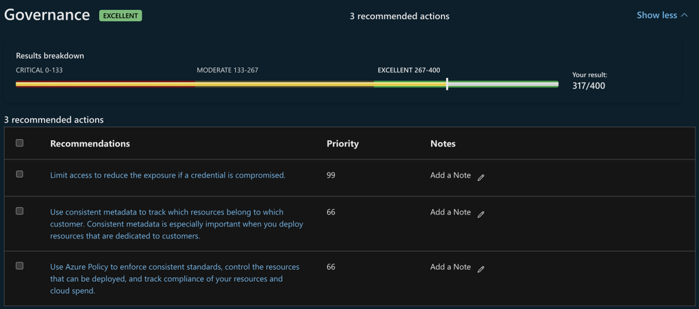
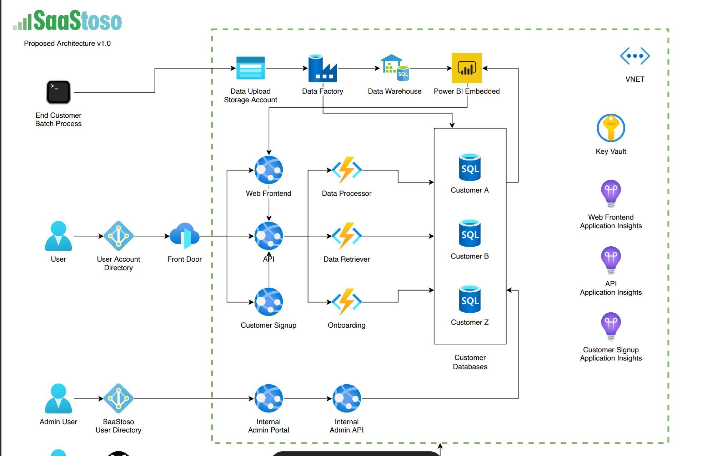

# Certified Software Designation Technical Criteria

This repository provides guidelines for Technical Criteria for [Solutions Partner with certified software for Azure ](https://learn.microsoft.com/en-us/partner-center/referrals/solutions-partner-certified-software-solution-area#requirements-for-azure).

Included in this guide are guidelines around the 5 key steps for Technical Criteria.  For full details, please see the [Technical Audit](https://aka.ms/Certifiedsoftware_audit_Azure).

## Solution Interoperability

Work with your team to ensure that your solution has interoperability with Azure products, platforms, and services, with specific criteria according to the solution's integration scenarios:
- Data
- AI provider
- Compute
- Container
- Integration (for example, connectors)
- Control Plane 

## Well-Architected Framework Review
Complete a [Well-Architected Framework Assessment](https://learn.microsoft.com/en-us/assessments/azure-architecture-review/) or if building a SaaS Solution, complete [Well-Architected Framework for SaaS Assessment](https://learn.microsoft.com/en-us/azure/well-architected/saas/assessment).  

## Azure Advisor
Provide the Azure Advisor Score output and screenshot from the Azure portal. More details at [Azure Advisor Instructions](https://learn.microsoft.com/en-us/azure/advisor/azure-advisor-score).

## Security Posture
Provide a score output or screenshot from the CSPM from the last 30 days.  As an example, this would include the Azure Secure Score output and screenshot from the Azure portal. More details to get [Secure Score](https://learn.microsoft.com/en-us/azure/defender-for-cloud/secure-score-security-controls).

## Architecture Diagram
Below is a sample architecture diagram.  Architecture Diagram should focus on Azure components and interactions:

